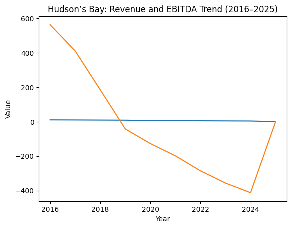

# Hudson’s Bay (2016–2025)
## Business Analyst Case Study: KPI Deterioration & Missed Intervention Window

---

## Purpose

This project demonstrates **Business Analyst decision-support thinking** using a real-world retail failure.

The objective is to:
- analyze long-term KPI deterioration
- identify early warning signals
- link metrics to business decisions
- evaluate whether the intervention was financially viable

This is not a narrative case study.  
It is a **metric-led diagnosis**.

---

## Role & Perspective

**Simulated role:** Business Analyst  
**Focus areas:**
- Financial performance
- Operational efficiency
- Customer behavior
- Digital channel performance
- Scenario and investment analysis

---

## Methodology

1. Identify critical KPIs across functions  
2. Track trends over time (2016–2025)  
3. Benchmark against industry norms  
4. Isolate compounding failure points  
5. Model alternative outcomes  

---

## Key KPI Findings

### Financial Performance
- Revenue declined **63%** from peak
- Operating margin deteriorated from **+5.4% to -18.4%**
- EBITDA declined by **$974M**
- Debt-to-equity increased nearly **5x**

**Insight:** Margin collapse preceded revenue failure, reducing strategic flexibility.

---

### Store Productivity
- Store count reduced **65%**
- Sales per square foot declined **50%**
- Daily store traffic declined **63%**

**Insight:** Store closures were reactive and did not improve unit economics.

---

### Inventory & Supply Chain
- Inventory turnover declined to **1.8x**
- Days inventory increased to **203**
- Markdown rate reached **48%**

**Insight:** Inventory inefficiency became a structural margin drag.

---

### Customer & Digital Metrics
- Loyalty members declined **57%**
- Repeat purchase rate fell to **19%**
- Net Promoter Score declined to **-8**
- E-commerce penetration stalled at **16.8%**
- Mobile conversion averaged **0.8%**

**Insight:** Customer erosion preceded revenue decline.

---

## Key Visuals

### Revenue vs EBITDA Trend

*Revenue declined steadily, while EBITDA collapsed faster, indicating structural cost and margin issues.*

---

### Inventory Efficiency Decline

*Rising days inventory and declining turnover show persistent demand planning failures.*

---

## Root Cause Summary

| KPI Impact Area | Root Cause |
|-----------------|-----------|
Revenue & Margin | High leverage limited reinvestment |
Customer Loss | Weak digital experience |
Inventory | Legacy planning systems |
Stores | No productivity-led strategy |
Decision Lag | Fragmented data environment |

---

## Missed Intervention Window

Based on KPI trajectories, **2020–2021** represented the final viable intervention period:
- Customer base still active
- Brand equity intact
- Capital access feasible

Post-2022 deterioration crossed recovery thresholds.

---

## Scenario Analysis

A modeled **$450M investment (2020–2024)** focused on:
- E-commerce & mobile
- Customer data & analytics
- Inventory optimization
- Store productivity
- Loyalty and retention

**Modeled outcome:**
- Revenue recovery to ~**$8B**
- Operating margin ~**+6%**
- Positive EBITDA
- Inventory turnover ~**3.8x**
- E-commerce share **>30%**
- NPS restored to positive range

**Conclusion:** Recovery was financially viable but time-sensitive.

---

## Business Analyst Recommendations

**Immediate**
- Reduce debt via non-core asset divestment
- Establish unified customer data platform
- Fix digital conversion bottlenecks

**Short-Term**
- Implement demand forecasting and inventory optimization
- Expand omnichannel capabilities
- Relaunch loyalty with behavioral data

**Medium-Term**
- Focus stores on productivity, not footprint
- Increase private-label margin contribution

---

## Reusable Warning Framework

Retailers showing **5+ indicators** below require immediate action:
- Multi-year same-store sales decline
- Inventory turnover below benchmark
- E-commerce growth below market
- Declining NPS
- Technology spend <2% of revenue
- High markdown dependency

---

## Data Notes

Dataset compiled from public filings, industry benchmarks, and analyst estimates.  
Operational and customer metrics are **modeled for analytical purposes**, not audited figures.

---

## Author

**Akash Singh**  
Business Analyst
