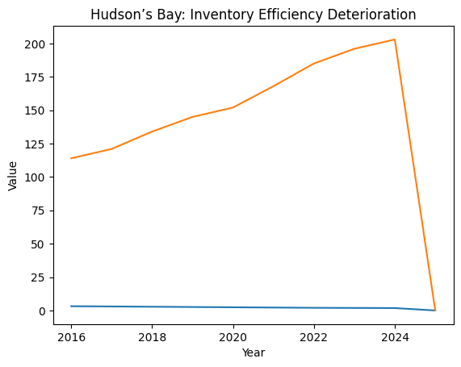

# Hudson’s Bay (2016–2025)
## Business Analyst Case Study: KPI Deterioration & Missed Intervention Window

This repository presents a Business Analyst case study on Hudson’s Bay’s decline between 2016 and 2025.  
The analysis examines long-term KPI trends across financial, operational, customer, and digital dimensions to identify early warning signals and evaluate whether intervention was feasible.

The objective is to demonstrate **metric-led decision support**, not retrospective storytelling.

---

## At-a-Glance

- Analyzed Hudson’s Bay’s decline using multi-year KPI trends (2016–2025)  
- Identified early warning signals that made failure predictable years in advance  
- Evaluated when recovery stopped being economically viable  
- Found that closure resulted from execution timing, not lack of strategic options  

---

## Scope Clarification

**What this analysis is:**
- A Business Analyst–style KPI diagnosis and decision-support exercise  
- Focused on identifying risk signals and intervention feasibility  

**What this analysis is not:**
- An internal Hudson’s Bay data disclosure  
- A hindsight narrative or academic case study  
- A claim of access to proprietary information  

---

## Purpose

This project demonstrates Business Analyst decision-support thinking using a real-world retail failure.

The objectives are to:
- analyze multi-year KPI deterioration  
- identify early warning indicators  
- connect metrics to business decisions  
- assess whether alternative actions were financially viable  

This is a KPI-driven diagnosis.

---

## Role & Perspective

Simulated role: **Business Analyst**

Primary responsibilities:
- monitor performance indicators  
- surface risks early  
- translate data into actionable insights  
- support leadership decision-making  

---

## How Decisions Were Supported

This analysis was structured to support leadership decisions by:

1. Monitoring KPIs that materially affect strategic options  
2. Tracking multi-year trends to separate noise from structural decline  
3. Identifying when compounding effects reduced future optionality  
4. Testing whether alternative actions were economically viable within time constraints  

---

## Key KPI Findings

### Financial Performance
- Revenue declined **63%** from peak  
- Operating margin deteriorated from **+5.4% to -18.4%**  
- EBITDA declined by **$974M**  
- Debt-to-equity increased nearly **5x**

**Insight:**  
Margin collapse preceded revenue failure, reducing strategic flexibility and reinvestment capacity.

---

### Store Productivity
- Store count reduced **65%**  
- Sales per square foot declined **50%**  
- Daily store traffic declined **63%**

**Insight:**  
Store closures were reactive and did not improve unit-level economics.

---

### Inventory & Supply Chain
- Inventory turnover declined to **1.8x**  
- Days inventory increased to **203**  
- Markdown rate reached **48%**

**Insight:**  
Inventory inefficiency became a recurring margin drag rather than a short-term operational issue.

---

### Customer & Digital Metrics
- Loyalty members declined **57%**  
- Repeat purchase rate fell to **19%**  
- Net Promoter Score declined to **-8**  
- E-commerce penetration stalled at **16.8%**  
- Mobile conversion averaged **0.8%**

**Insight:**  
Customer erosion occurred before revenue collapse, signaling early brand and experience issues.

---

## Key Visuals

### Revenue vs EBITDA Trend

Revenue declined steadily, while EBITDA deteriorated faster, indicating structural cost and margin issues.

---

### Inventory Efficiency Decline

Declining inventory turnover and rising days inventory highlight persistent demand planning and execution gaps.

---

## Root Cause Summary

| KPI Impact Area | Identified Root Cause |
|-----------------|----------------------|
Revenue & Margin | High leverage limited reinvestment |
Customer Loss | Weak digital experience and personalization |
Inventory | Legacy planning and forecasting systems |
Stores | No productivity-led store strategy |
Decision Lag | Fragmented data and manual reporting |

---

## Key Decision Moment: 2020–2021

By 2020, KPI trends indicated a narrowing set of options:
- Margins were negative but not yet irreversible  
- Customer base remained large enough to recover lifetime value  
- Capital access was still feasible  
- Operational inefficiencies were measurable and correctable  

Post-2021, declining margins, rising leverage, and accelerating customer churn significantly reduced recovery feasibility.

This period represented the final point at which intervention remained economically rational.

---

## Scenario Analysis

A modeled **$450M investment (2020–2024)** focused on:
- e-commerce and mobile platforms  
- customer data and analytics  
- inventory optimization  
- store productivity initiatives  
- loyalty and retention programs  

Modeled outcome (base case):
- revenue recovery to ~**$8B**  
- operating margin ~**+6%**  
- return to positive EBITDA  
- inventory turnover improvement to ~**3.8x**  
- e-commerce contribution **>30%**  
- NPS restored to positive range  

**Assessment:**  
Recovery was financially viable but highly time-sensitive.

---

## Reusable Warning Framework

Retailers exhibiting **five or more** of the following indicators require immediate action:
- multi-year same-store sales decline  
- inventory turnover below benchmark  
- e-commerce growth below market  
- declining NPS  
- technology spend <2% of revenue  
- high markdown dependency  

---

## Data Notes & Reference Context

The dataset was compiled from publicly available information, industry benchmarks, and analyst estimates.  
Operational and customer metrics are modeled for analytical purposes and are not audited figures.

Reference context includes:
- Hudson’s Bay historical revenue from public financial summaries
- Industry benchmarks from retail performance reports
- Context from news on Canadian retail trends

---

## What Could Have Prevented Closure

The analysis indicates that Hudson’s Bay’s closure was driven by compounding execution failures visible in KPI trends years in advance.

From a Business Analyst perspective, the following factors would have had the highest probability of preventing closure:

1. **Earlier capital reallocation**  
   Reducing leverage through non-core asset divestment would have restored financial flexibility before KPI deterioration became irreversible.

2. **Timely digital and omnichannel execution**  
   Closing conversion, fulfillment, and mobile experience gaps between 2018–2021 would have slowed customer erosion.

3. **Inventory and demand planning discipline**  
   Predictive forecasting and inventory optimization would have reduced excess stock, markdown dependency, and margin compression.

4. **Customer data–led retention strategy**  
   A unified customer data platform enabling personalization could have improved repeat purchase behavior and lifetime value.

5. **Productivity-led store strategy**  
   Shifting focus from footprint reduction to unit-level profitability would have stabilized store economics.

Collectively, these actions required speed and prioritization rather than novel strategy.  
The data suggests that execution timing—not lack of options—ultimately determined the outcome.

---

## Author

Akash Singh  
Business Analyst
